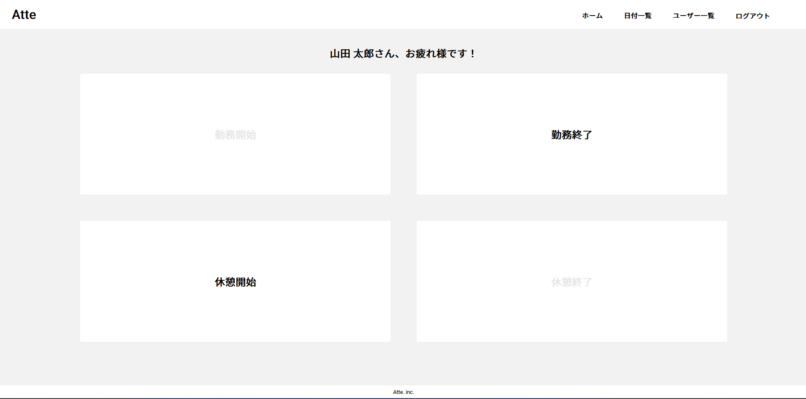
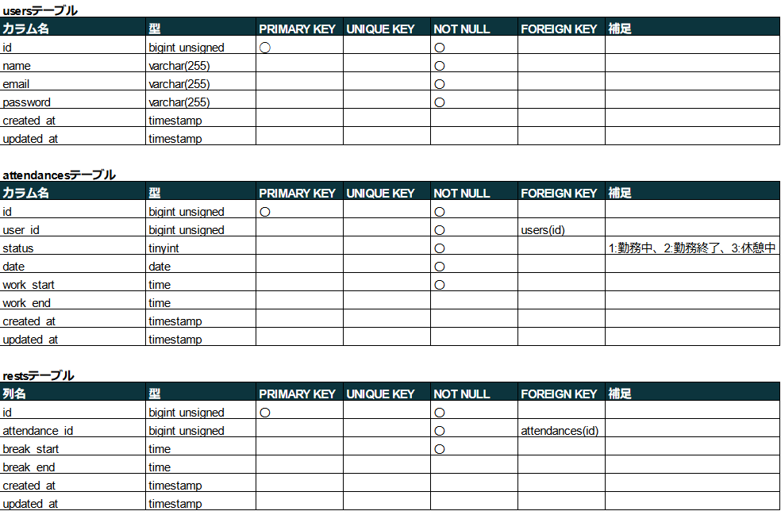

# 勤怠管理アプリケーション

勤怠管理アプリ

## 作成した目的

人事評価を目的とした勤怠管理のため

## アプリケーション URL

## ローカル環境

- アプリケーション URL：http://localhost/
- phpMyAdmin：http://localhost:8080/
- mailhog：http://localhost:8025/

## グローバル環境

### 開発環境

.png>)

- RDS を利用せず、EC2 インスタンス内でデータベースを保持
- 会員登録時のメール認証は mailhog を利用し確認。
- アプリケーション URL：http://13.208.166.130
- phpMyAdmin：http://13.208.166.130:8080/
- mailhog：http://13.208.166.130:8025/

### 本番環境

.png>)

- RDS を利用して、データベースサーバを別建て
- 会員登録時のメール認証は gmail の smtp サーバを利用。
- アプリケーション URL：http://13.208.184.250
- 管理者 ID  
   email : admin@admin.com  
   password : password

## 他のリポジトリ

なし

## 機能一覧

| 項目                   | 注意点                                     |
| ---------------------- | ------------------------------------------ |
| 会員登録               | Laravel の認証機能を利用                   |
| ログイン               |                                            |
| ログアウト             |                                            |
| 勤務開始               | 日を跨いだ時点で翌日の出勤操作に切り替える |
| 勤務終了               |                                            |
| 休憩開始               | 1 日で何度も休憩が可能                     |
| 休憩終了               |                                            |
| 日付別勤怠情報取得     |                                            |
| ユーザーの一覧表示     |                                            |
| ユーザー別勤怠情報取得 |                                            |
| ページネーション       | 5 件ずつ取得                               |

## 使用技術(実行環境)

- PHP 7.4.9
- Laravel 8.6.12
- MySQL 8.0.35
- nginx 1.21.1
- fortify 1.19

## テーブル設計

## ER 図

## 環境構築

### Docker ビルド

1. `git clone {URL}`
2. `docker-compose up -d --build`

＊ MySQL は、OS によって起動しない場合があるのでそれぞれの PC に合わせて、docker-compose.yml ファイルを編集してください。

### Laravel 環境構築

1. `docker-compose exec php bash`
2. `composer install`
3. .env.example ファイルから.env を作成し、環境変数を変更

   - "docker-compose.yml"を参考に DB の設定を修正
   - 送信元アドレスの値(MAIL_FROM_ADDRESS)に任意の値を入力

4. `php artisan key:generate`
5. `php artisan migrate`
6. `php artisan db:seed`
